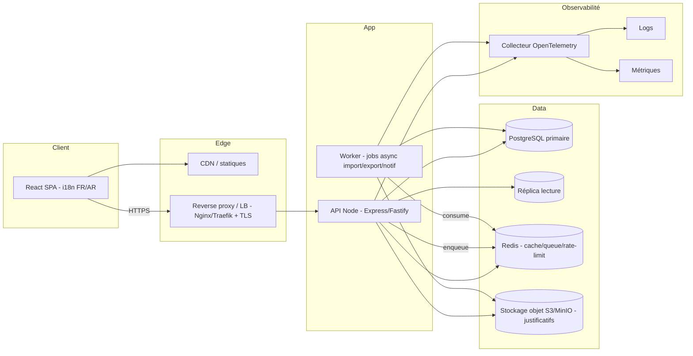

# Full — Architecture technique

## 1. Vue d'ensemble cible



---

## 2. Style d'architecture

- **Architecture modulaire orientée domaine** (modular monolith), prête à extraire des services si besoin.
- **Couches** : `interface (routes/controllers)` → `application (services/use-cases)` → `domain (entités, règles)` → `infrastructure (repositories, ORM, queue, storage)`.
- **CQRS léger** : lectures optimisées (vues/réplica) séparées des écritures (transactions).
- **Jobs asynchrones** (worker) pour imports volumineux, exports lourds, e-mails, recalcul de seuils.
- **API versionnée** : préfixe `/api/v1`.

---

## 3. Arborescence du monorepo (complet)

```
sarah/
├─ apps/
│  ├─ api/                  # backend Express/Fastify
│  │  ├─ src/
│  │  │  ├─ config/
│  │  │  ├─ modules/
│  │  │  │  ├─ auth/        # login, refresh, 2FA
│  │  │  │  ├─ users/
│  │  │  │  ├─ agences/
│  │  │  │  ├─ pieces/
│  │  │  │  ├─ marques/     # compatibilités
│  │  │  │  ├─ stocks/
│  │  │  │  ├─ mouvements/
│  │  │  │  ├─ justificatifs/
│  │  │  │  ├─ excel/       # import/export
│  │  │  │  ├─ notifications/
│  │  │  │  ├─ dashboard/
│  │  │  │  └─ audit/
│  │  │  ├─ shared/         # errors, result, pagination, otel
│  │  │  ├─ db/             # prisma/drizzle schema + migrations
│  │  │  ├─ queue/          # producers/consumers
│  │  │  └─ server.ts
│  │  └─ tests/
│  ├─ worker/               # consommateurs de jobs (ou intégré à l'api)
│  └─ web/                  # frontend React
│     ├─ src/
│     │  ├─ app/            # providers (query, i18n, theme, auth)
│     │  ├─ features/
│     │  ├─ components/ui/  # shadcn/ui
│     │  ├─ locales/        # fr, ar
│     │  ├─ lib/
│     │  └─ routes/
│     └─ ...
├─ packages/
│  ├─ shared-types/         # types partagés API <-> web (zod schemas)
│  └─ config/               # eslint, tsconfig, tailwind preset
├─ infra/
│  ├─ docker/
│  ├─ k8s/                  # manifests (optionnel)
│  └─ nginx/ | traefik/
├─ .github/workflows/       # CI/CD
└─ docker-compose.yml
```

> Outils monorepo possibles : **pnpm workspaces** + **Turborepo** (cache de build/test).

---

## 4. Stack & dépendances (complet)

### Backend
| Domaine | Choix |
|---|---|
| Serveur | Express ou **Fastify** (perf + schémas) |
| ORM | **Prisma** ou **Drizzle** (migrations typées) |
| Validation | Zod (partagé via `packages/shared-types`) |
| Auth | jsonwebtoken + bcrypt/argon2 + 2FA (`otplib`) |
| Cache/queue | Redis + **BullMQ** (jobs) |
| Stockage objet | AWS SDK / MinIO client |
| Excel | SheetJS (`xlsx`) + streaming pour gros fichiers |
| Mail | Nodemailer / fournisseur SMTP |
| Observabilité | `@opentelemetry/*`, `pino` |
| Sécurité | helmet, cors, express-rate-limit (+ store Redis) |
| Tests | Vitest/Jest, supertest, Testcontainers |

### Frontend
| Domaine | Choix |
|---|---|
| UI | React + **shadcn/ui** (Radix) + Tailwind |
| Data | TanStack Query + Axios |
| Formulaires | React Hook Form + Zod |
| i18n | `i18next` + `react-i18next` (FR/AR, RTL) |
| Graphiques | Recharts / visx (dashboard) |
| Thème | next-themes-like toggle (clair/sombre) |
| Tables | TanStack Table (tri/filtre/pagination serveur) |
| e2e | Playwright |

---

## 5. Scalabilité & performance

- **Réplica lecture** PostgreSQL pour les consultations/exports lourds.
- **Cache Redis** pour consultations fréquentes (référence → stock) avec invalidation sur mouvement.
- **Pagination serveur** + index adaptés (références, dates, agence).
- **Jobs async** pour imports/exports massifs (pas de blocage requête HTTP).
- **Compression** (gzip/brotli) côté proxy, **CDN** pour statiques.

---

## 6. Contrats partagés

- `packages/shared-types` expose les **schémas Zod** et types TS utilisés par l'API et le web → un seul endroit de vérité pour les DTO.
- Génération possible d'un **client API typé** à partir des schémas (ou OpenAPI).

---

## 7. Conventions

- API `/api/v1`, réponses `{ data, meta }` / erreurs `{ error: { code, message, details, traceId } }`.
- `traceId` propagé (OpenTelemetry) pour corréler logs et réponses.
- Migrations versionnées et revues.
- Feature flags simples pour activer/désactiver options (2FA, notifications).
