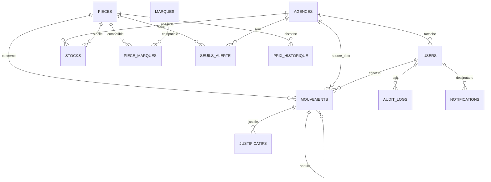

# Full — Modèle de données complet

## 1. Schéma relationnel



---

## 2. Tables (en plus / enrichies par rapport au MVP)

### 2.1 Pièces (enrichies)
```sql
CREATE TABLE pieces (
  id               UUID PRIMARY KEY DEFAULT gen_random_uuid(),
  reference        TEXT NOT NULL UNIQUE,
  nom              TEXT NOT NULL,
  pays_origine     TEXT,
  pays_importation TEXT,
  prix_usd         NUMERIC(12,2),
  prix_dzd         NUMERIC(12,2),
  prix_eur         NUMERIC(12,2),
  prix_ht          NUMERIC(12,2),
  prix_ttc         NUMERIC(12,2),
  taux_tva         NUMERIC(5,2) DEFAULT 19.00,
  actif            BOOLEAN NOT NULL DEFAULT true,
  created_at       TIMESTAMPTZ NOT NULL DEFAULT now(),
  updated_at       TIMESTAMPTZ NOT NULL DEFAULT now()
);
```

### 2.2 Marques & compatibilités (N-N)
```sql
CREATE TABLE marques (
  id   UUID PRIMARY KEY DEFAULT gen_random_uuid(),
  nom  TEXT NOT NULL UNIQUE
);
CREATE TABLE piece_marques (
  piece_id  UUID REFERENCES pieces(id) ON DELETE CASCADE,
  marque_id UUID REFERENCES marques(id) ON DELETE CASCADE,
  PRIMARY KEY (piece_id, marque_id)
);
```
> Permet « toutes les pièces compatibles Caterpillar » et l'affichage des marques d'une pièce.

### 2.3 Mouvements (enrichis) + justificatifs
```sql
CREATE TABLE mouvements (
  id                  UUID PRIMARY KEY DEFAULT gen_random_uuid(),
  type                TEXT NOT NULL CHECK (type IN ('entree','sortie','transfert','annulation')),
  piece_id            UUID NOT NULL REFERENCES pieces(id) ON DELETE RESTRICT,
  agence_source_id    UUID REFERENCES agences(id),
  agence_dest_id      UUID REFERENCES agences(id),
  quantite            INTEGER NOT NULL CHECK (quantite > 0),
  user_id             UUID REFERENCES users(id),
  motif               TEXT,
  reference_externe   TEXT,                 -- n° facture Excel
  mouvement_annule_id UUID REFERENCES mouvements(id),
  import_batch_id     UUID,                 -- traçabilité d'import
  created_at          TIMESTAMPTZ NOT NULL DEFAULT now()
);

CREATE TABLE justificatifs (
  id            UUID PRIMARY KEY DEFAULT gen_random_uuid(),
  mouvement_id  UUID NOT NULL REFERENCES mouvements(id) ON DELETE CASCADE,
  nom_fichier   TEXT NOT NULL,
  storage_key   TEXT NOT NULL,             -- clé S3/MinIO
  content_type  TEXT,
  taille        BIGINT,
  uploaded_by   UUID REFERENCES users(id),
  created_at    TIMESTAMPTZ NOT NULL DEFAULT now()
);
```

### 2.4 Seuils d'alerte (stock bas)
```sql
CREATE TABLE seuils_alerte (
  id          UUID PRIMARY KEY DEFAULT gen_random_uuid(),
  piece_id    UUID NOT NULL REFERENCES pieces(id) ON DELETE CASCADE,
  agence_id   UUID REFERENCES agences(id) ON DELETE CASCADE, -- NULL = global
  seuil_min   INTEGER NOT NULL CHECK (seuil_min >= 0),
  UNIQUE (piece_id, agence_id)
);
```

### 2.5 Audit immuable
```sql
CREATE TABLE audit_logs (
  id          BIGSERIAL PRIMARY KEY,
  user_id     UUID REFERENCES users(id),
  action      TEXT NOT NULL,              -- LOGIN, IMPORT, MOUVEMENT_CREATE, USER_UPDATE...
  entite      TEXT,                       -- piece, stock, mouvement, user...
  entite_id   TEXT,
  details     JSONB,                      -- diff / payload non sensible
  ip          INET,
  user_agent  TEXT,
  created_at  TIMESTAMPTZ NOT NULL DEFAULT now()
);
-- Pas d'UPDATE/DELETE applicatif : table append-only.
```

### 2.6 Notifications
```sql
CREATE TABLE notifications (
  id          UUID PRIMARY KEY DEFAULT gen_random_uuid(),
  user_id     UUID NOT NULL REFERENCES users(id) ON DELETE CASCADE,
  type        TEXT NOT NULL,              -- STOCK_BAS, TRANSFERT_RECU, IMPORT_TERMINE...
  titre       TEXT NOT NULL,
  message     TEXT,
  lu          BOOLEAN NOT NULL DEFAULT false,
  data        JSONB,
  created_at  TIMESTAMPTZ NOT NULL DEFAULT now()
);
```

### 2.7 Historique de prix (optionnel)
```sql
CREATE TABLE prix_historique (
  id          UUID PRIMARY KEY DEFAULT gen_random_uuid(),
  piece_id    UUID NOT NULL REFERENCES pieces(id) ON DELETE CASCADE,
  prix_usd    NUMERIC(12,2),
  prix_dzd    NUMERIC(12,2),
  source      TEXT,                       -- import, manuel
  created_at  TIMESTAMPTZ NOT NULL DEFAULT now()
);
```

### 2.8 Auth avancée
```sql
CREATE TABLE refresh_tokens (
  id          UUID PRIMARY KEY DEFAULT gen_random_uuid(),
  user_id     UUID NOT NULL REFERENCES users(id) ON DELETE CASCADE,
  token_hash  TEXT NOT NULL,             -- jamais en clair
  expires_at  TIMESTAMPTZ NOT NULL,
  revoked_at  TIMESTAMPTZ,
  created_at  TIMESTAMPTZ NOT NULL DEFAULT now()
);

ALTER TABLE users ADD COLUMN totp_secret TEXT;        -- 2FA (chiffré)
ALTER TABLE users ADD COLUMN totp_enabled BOOLEAN DEFAULT false;
ALTER TABLE users ADD COLUMN last_login_at TIMESTAMPTZ;
```

---

## 3. Index & performance

```sql
CREATE INDEX idx_pm_marque        ON piece_marques(marque_id);
CREATE INDEX idx_mvt_type_date    ON mouvements(type, created_at DESC);
CREATE INDEX idx_mvt_agences      ON mouvements(agence_source_id, agence_dest_id);
CREATE INDEX idx_audit_user_date  ON audit_logs(user_id, created_at DESC);
CREATE INDEX idx_notif_user_lu    ON notifications(user_id, lu);
CREATE INDEX idx_pieces_nom_trgm  ON pieces USING gin (nom gin_trgm_ops); -- recherche floue
```
> Activer `pg_trgm` pour la recherche par nom/référence.

---

## 4. Intégrité & cohérence

- Stock toujours maintenu par mouvements en **transaction** + `SELECT ... FOR UPDATE`.
- `quantite >= 0` garanti ; transferts/sorties vérifient la disponibilité.
- Audit append-only (révoquer les droits UPDATE/DELETE applicatifs sur `audit_logs`).
- Migrations gérées par l'ORM (Prisma/Drizzle), revues en PR.

---

## 5. Vues utiles

```sql
-- Stock consolidé par référence (consultation rapide / dashboard)
CREATE VIEW v_stock_total AS
SELECT p.reference, p.nom, SUM(s.quantite) AS total
FROM pieces p LEFT JOIN stocks s ON s.piece_id = p.id
GROUP BY p.reference, p.nom;

-- Alertes stock bas
CREATE VIEW v_alertes_stock AS
SELECT p.reference, a.nom AS agence, s.quantite, sa.seuil_min
FROM stocks s
JOIN pieces p ON p.id = s.piece_id
JOIN agences a ON a.id = s.agence_id
JOIN seuils_alerte sa ON sa.piece_id = s.piece_id
   AND (sa.agence_id = s.agence_id OR sa.agence_id IS NULL)
WHERE s.quantite <= sa.seuil_min;
```
