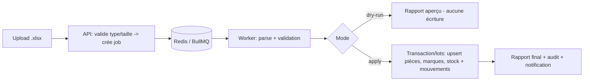

# Full — Import / Export Excel industriel

> Étend `../mvp/07-excel.md` : multi-feuilles, marques, validation riche, **traitement asynchrone**, mode aperçu (dry-run), gros volumes.

## 1. Fichier d'import multi-feuilles

| Feuille | Contenu | Clé |
|---|---|---|
| `pieces` | reference, nom, pays_origine, pays_importation, prix_usd, prix_dzd, prix_eur, prix_ht, prix_ttc, taux_tva | `reference` |
| `marques` | reference, marque(s) (séparées par `;`) | `reference` |
| `stock` | reference, quantite (à cumuler) | `reference` |

- **Agence cible** : forcée pour le responsable, sélectionnée par l'admin dans l'UI (jamais dans le fichier pour éviter les erreurs).
- En-têtes normalisés (casse/accents/espaces).
- Compat ascendante : un fichier « stock simple » (comme le MVP) reste accepté.

---

## 2. Pipeline d'import asynchrone

### Étapes
1. **Upload** → validation type/taille → création d'un **job** (`jobId`, `import_batch_id`).
2. **Parsing en streaming** (gros fichiers) feuille par feuille.
3. **Validation riche** (Zod) ligne par ligne : types, bornes, références, cohérence prix HT/TTC.
4. **Mode aperçu (dry-run)** : calcule les changements (créations, cumuls, conflits) **sans écrire** → rapport.
5. **Confirmation** → application en **transactions par lots** :
   - upsert pièces (création auto si inconnue),
   - upsert associations marques,
   - cumul stock (`existant + importé`),
   - insertion mouvements `entree` (avec `import_batch_id`).
6. **Rapport final** téléchargeable + entrée d'audit + notification « import terminé ».

### Garanties
- **Idempotence** via `import_batch_id` (rejouer un même batch ne double pas).
- **Best-effort par lot** : lignes invalides isolées dans le rapport ; option « tout ou rien ».
- **Reprise** sur incident (retry/backoff), **dead-letter** si échec persistant.

---

## 3. Règles métier (rappel + extensions)

- **Cumul** : `CAT001 20 + import 10 = 30`.
- **Création auto** pièce + stock pour référence inconnue.
- **Marques** : ajout des compatibilités déclarées (création de la marque si nouvelle).
- **Prix** : mise à jour + historisation (`prix_historique`) si activée.
- **Validation cohérence** : `prix_ttc >= prix_ht`, `taux_tva` plausible, quantités entières > 0.

---

## 4. Exports (complet)

| Export | Endpoint | Contenu | Async ? |
|---|---|---|---|
| Stock | `/export/stock` | reference, nom, agence, quantité (scope) | si volumineux |
| Pièces | `/export/pieces` | toutes infos + marques + prix | non |
| Mouvements | `/export/mouvements` | type, référence, qté, agences, user, date, motif, n° facture | si volumineux |
| Audit | `/export/audit` (admin) | journal complet | oui |
| Alertes | `/export/alertes` | stock sous seuil | non |

- Gros exports → **job** → fichier stocké → **URL signée** + notification.
- Formats localisés (dates/devises selon langue).
- Respect du **scope agence** (responsable/vendeur).

---

## 5. Modèles téléchargeables

- `/template/pieces`, `/template/marques`, `/template/stock` : classeurs avec en-têtes, exemples et feuille « instructions » (FR/AR).

---

## 6. Réversibilité & cohérence

- Exports **réimportables** (mêmes en-têtes).
- Un import est **annulable** au niveau mouvements (via `import_batch_id` → annulations groupées) — option avancée.
- Tests d'intégration : export → réimport → cohérence ; dry-run == apply (mêmes diffs).

---

## 7. Performance

- Parsing **streaming** + écritures **par lots** (ex. 1000 lignes/transaction).
- Index adaptés (référence) ; `COPY`/bulk insert pour très gros volumes.
- Progression remontée au front (polling `/import/:jobId`).
