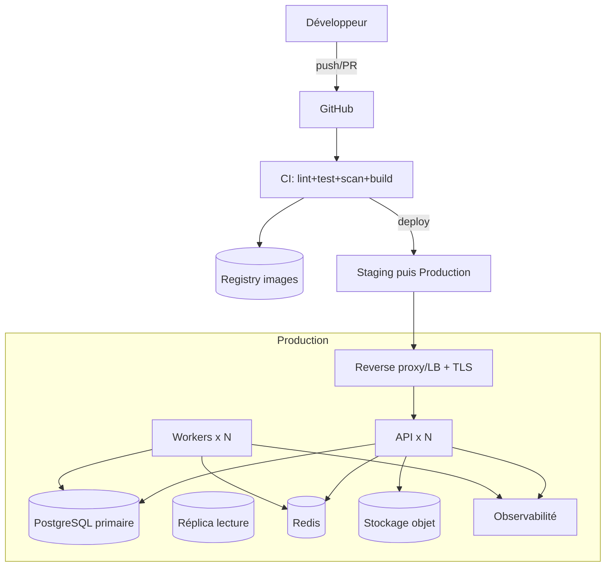

# Full — Déploiement, CI/CD & Observabilité

> Étend `../mvp/08-deployment.md`. Cible : production robuste, automatisée, observable et sauvegardée.

## 1. Topologie cible



---

## 2. Environnements

| Env | Usage | Données |
|---|---|---|
| `local` | dev (Docker Compose) | jeu de démo |
| `staging` | recette/QA, tests e2e, DAST | données anonymisées |
| `production` | exploitation | réelles |

- Config par variables d'environnement / secrets, **jamais** dans le code.
- Parité dev/prod maximale (mêmes images).

---

## 3. CI/CD (GitHub Actions)

### Pipeline CI (sur PR)
```text
1. Setup (pnpm, cache Turborepo)
2. Lint + typecheck (ESLint, tsc)
3. Tests unitaires + intégration (Testcontainers Postgres/Redis)
4. Tests e2e (Playwright) sur preview
5. Scans sécurité : npm audit / SCA, gitleaks (secrets), SAST
6. Build images Docker (api, web, worker)
7. Scan images (Trivy)
```

### Pipeline CD
```text
- Merge sur main -> build + push images taguées (sha)
- Déploiement automatique en STAGING -> smoke tests + DAST (ZAP)
- Approbation manuelle -> déploiement PRODUCTION (rolling)
- Migrations DB exécutées de façon contrôlée (job dédié, backward-compatible)
- Rollback : redeploy image précédente
```

---

## 4. Conteneurs & orchestration

- **Images multi-stage** minimales (node:alpine, utilisateur non-root, `NODE_ENV=production`).
- **Healthchecks** (`/health`, `/ready`) + `restart: unless-stopped`.
- **Option A — Docker Compose durci** (1–2 VPS) : simple, suffisant pour démarrer.
- **Option B — Kubernetes** (scaling, HPA, secrets, ingress) si volume/criticité élevés.
- **Workers** séparés de l'API (scalables indépendamment).

---

## 5. Reverse proxy & TLS

- **Nginx** ou **Traefik** : TLS (Let's Encrypt, renouvellement auto), HSTS, gzip/brotli.
- Limites upload (Excel/justificatifs), timeouts adaptés aux jobs.
- Routage `/api/v1` → API, statiques → web (ou CDN).

---

## 6. Base de données

- PostgreSQL managé **ou** auto-hébergé avec :
  - **réplica en lecture** (consultations/exports),
  - **PITR** (Point-In-Time Recovery) / WAL archiving,
  - **sauvegardes** quotidiennes + hebdo, **chiffrées**, **testées** (restauration régulière),
  - rétention définie (ex. 30 jours).
- Migrations **backward-compatible** (expand/contract) pour zéro-downtime.

---

## 7. Observabilité

| Pilier | Outils | Contenu |
|---|---|---|
| **Logs** | pino + agrégateur (Loki/ELK) | structurés, `traceId`, sans données sensibles |
| **Métriques** | OpenTelemetry + Prometheus/Grafana | latence, erreurs, RPS, taille file jobs, durée imports |
| **Traces** | OpenTelemetry | bout-en-bout HTTP→DB→jobs |
| **Alerting** | Alertmanager / e-mail | erreurs 5xx, file saturée, échec import, DB down |

- Dashboards Grafana : santé API, jobs, DB, alertes métier (stock bas en masse).

---

## 8. Sauvegardes & PRA

- Sauvegardes DB chiffrées + stockage objet versionné pour justificatifs.
- **Plan de reprise** documenté : RTO/RPO cibles, procédure de restauration testée.
- Réplication stockage objet (justificatifs) si criticité.

---

## 9. Sécurité d'exploitation

- Secrets via Docker secrets / Vault / secrets CI chiffrés.
- Egress restreint, ports minimaux exposés, pare-feu.
- Mises à jour automatisées des dépendances (Renovate) + revue.
- Accès serveur par clés SSH, bastion, MFA sur le registry/cloud.

---

## 10. Procédure de mise en production (résumé)

```text
1. PR validée (CI verte: tests + scans)
2. Build + push images (tag sha)
3. Déploiement staging -> smoke + DAST
4. Approbation -> migration DB (expand) -> déploiement rolling prod
5. Vérifs post-déploiement (/ready, dashboards, smoke)
6. Migration contract (nettoyage) au cycle suivant
7. Rollback prêt (image n-1) en cas d'incident
```

---

## 11. Checklist Go-Live

- [ ] HTTPS + HSTS, CSP stricte, headers durcis
- [ ] Secrets gérés, rotation planifiée, scan secrets vert
- [ ] Sauvegardes testées (restauration OK), PITR actif
- [ ] Observabilité branchée (logs/métriques/traces/alertes)
- [ ] Rate limiting + 2FA admin activés
- [ ] Tests e2e + a11y verts, `npm audit`/Trivy sans critique
- [ ] Runbook incidents + contacts définis
