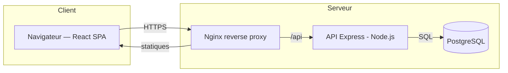
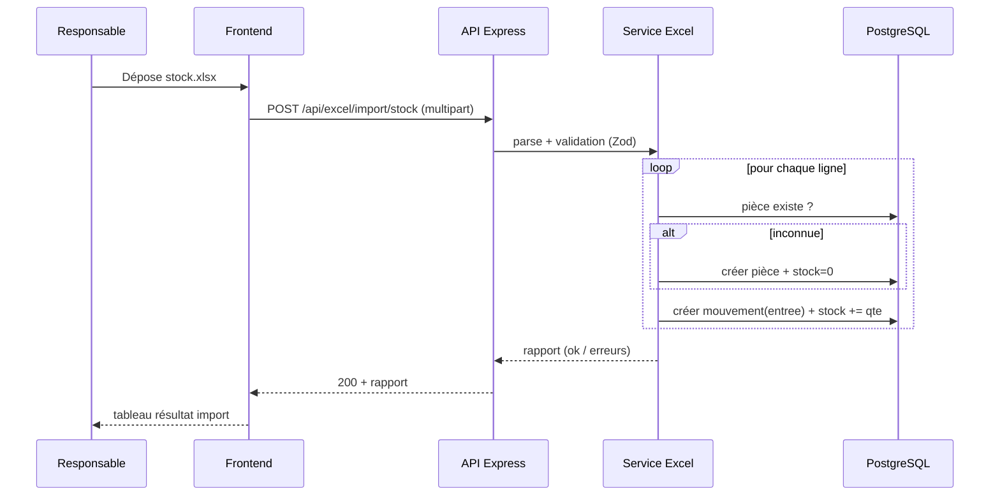

# MVP — Architecture technique

## 1. Vue d'ensemble



- **SPA React** servie en fichiers statiques par Nginx.
- **API REST Express** sous le préfixe `/api`.
- **PostgreSQL** comme unique source de vérité.
- Communication **stateless** via **JWT** (header `Authorization: Bearer`).

---

## 2. Style d'architecture

- **Architecture en couches** côté backend :
  `routes` → `controllers` → `services` (logique métier) → `repositories` (accès DB) → `db`.
- **Séparation stricte** : aucune requête SQL dans les contrôleurs ; toute la logique métier (mouvements, cumul de stock) vit dans les **services**.
- **DTO + validation** à la frontière (Zod) pour toute entrée utilisateur.

---

## 3. Arborescence du monorepo

```
sarah/
├─ docs/
├─ plan/
├─ backend/
│  ├─ src/
│  │  ├─ config/            # env, constantes
│  │  ├─ db/
│  │  │  ├─ index.ts        # pool pg
│  │  │  ├─ migrations/     # *.sql
│  │  │  └─ seed.ts
│  │  ├─ middleware/        # auth, role, error, validate
│  │  ├─ modules/
│  │  │  ├─ auth/
│  │  │  ├─ users/
│  │  │  ├─ agences/
│  │  │  ├─ pieces/
│  │  │  ├─ stocks/
│  │  │  ├─ mouvements/
│  │  │  └─ excel/          # import + export
│  │  ├─ utils/
│  │  ├─ app.ts             # express app
│  │  └─ server.ts          # bootstrap
│  ├─ tests/
│  ├─ .env.example
│  ├─ package.json
│  └─ tsconfig.json
├─ frontend/
│  ├─ src/
│  │  ├─ api/               # clients axios + tanstack-query
│  │  ├─ components/        # UI réutilisable
│  │  ├─ features/          # pieces, stocks, mouvements, auth
│  │  ├─ layouts/
│  │  ├─ pages/
│  │  ├─ context/           # AuthContext
│  │  ├─ hooks/
│  │  ├─ lib/               # utils, formatters
│  │  ├─ routes.tsx
│  │  ├─ theme/             # tokens Tailwind
│  │  └─ main.tsx
│  ├─ index.html
│  ├─ tailwind.config.ts
│  ├─ vite.config.ts
│  └─ package.json
├─ docker-compose.yml
└─ README.md
```

---

## 4. Stack & dépendances (MVP)

### Backend
| Dépendance | Rôle |
|---|---|
| `express` | serveur HTTP |
| `pg` | client PostgreSQL |
| `bcrypt` | hachage des mots de passe |
| `jsonwebtoken` | JWT |
| `zod` | validation des entrées |
| `multer` | upload du fichier Excel |
| `xlsx` (SheetJS) | parsing / génération Excel |
| `cors`, `helmet` | sécurité HTTP de base |
| `dotenv` | variables d'environnement |
| `pino` | logs structurés |
| Dev : `typescript`, `tsx`, `vitest`/`jest`, `supertest` | |

### Frontend
| Dépendance | Rôle |
|---|---|
| `react`, `react-dom` | UI |
| `react-router-dom` | routing |
| `@tanstack/react-query` | data fetching / cache |
| `axios` | HTTP |
| `tailwindcss` | styles |
| `react-hook-form` + `zod` | formulaires + validation |
| `lucide-react` | icônes |
| `react-hot-toast` | notifications |

---

## 5. Flux de données — exemple « Import Excel »



---

## 6. Conventions

- **TypeScript strict** des deux côtés.
- **ESLint + Prettier** partagés.
- **Nommage** : tables/colonnes en `snake_case`, code en `camelCase`.
- **Réponses API** uniformes : `{ data }` en succès, `{ error: { code, message, details? } }` en erreur.
- **Codes HTTP** cohérents : 200/201, 400 (validation), 401, 403, 404, 409 (conflit), 422, 500.
