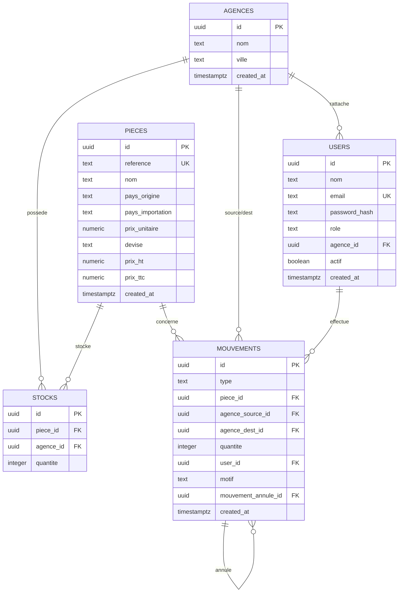

# MVP — Modèle de données

## 1. Schéma relationnel



---

## 2. Définition des tables (DDL)

> Fichier cible : `backend/src/db/migrations/001_init.sql`

```sql
CREATE EXTENSION IF NOT EXISTS "pgcrypto"; -- gen_random_uuid()

-- AGENCES
CREATE TABLE agences (
  id          UUID PRIMARY KEY DEFAULT gen_random_uuid(),
  nom         TEXT NOT NULL,
  ville       TEXT,
  created_at  TIMESTAMPTZ NOT NULL DEFAULT now()
);

-- USERS
CREATE TABLE users (
  id            UUID PRIMARY KEY DEFAULT gen_random_uuid(),
  nom           TEXT NOT NULL,
  email         TEXT NOT NULL UNIQUE,
  password_hash TEXT NOT NULL,
  role          TEXT NOT NULL CHECK (role IN ('admin','responsable','vendeur')),
  agence_id     UUID REFERENCES agences(id) ON DELETE SET NULL,
  actif         BOOLEAN NOT NULL DEFAULT true,
  created_at    TIMESTAMPTZ NOT NULL DEFAULT now()
);
-- Un responsable/vendeur DOIT avoir une agence ; un admin non.
ALTER TABLE users ADD CONSTRAINT chk_agence_role
  CHECK (role = 'admin' OR agence_id IS NOT NULL);

-- PIECES
CREATE TABLE pieces (
  id               UUID PRIMARY KEY DEFAULT gen_random_uuid(),
  reference        TEXT NOT NULL UNIQUE,
  nom              TEXT NOT NULL,
  pays_origine     TEXT,
  pays_importation TEXT,
  prix_unitaire    NUMERIC(12,2),
  devise           TEXT DEFAULT 'USD' CHECK (devise IN ('USD','EUR','DZD')),
  prix_ht          NUMERIC(12,2),
  prix_ttc         NUMERIC(12,2),
  created_at       TIMESTAMPTZ NOT NULL DEFAULT now()
);

-- STOCKS (quantité par pièce et agence)
CREATE TABLE stocks (
  id         UUID PRIMARY KEY DEFAULT gen_random_uuid(),
  piece_id   UUID NOT NULL REFERENCES pieces(id) ON DELETE CASCADE,
  agence_id  UUID NOT NULL REFERENCES agences(id) ON DELETE CASCADE,
  quantite   INTEGER NOT NULL DEFAULT 0 CHECK (quantite >= 0),
  UNIQUE (piece_id, agence_id)
);

-- MOUVEMENTS (historique source de vérité)
CREATE TABLE mouvements (
  id                  UUID PRIMARY KEY DEFAULT gen_random_uuid(),
  type                TEXT NOT NULL CHECK (type IN ('entree','sortie','transfert','annulation')),
  piece_id            UUID NOT NULL REFERENCES pieces(id) ON DELETE RESTRICT,
  agence_source_id    UUID REFERENCES agences(id),
  agence_dest_id      UUID REFERENCES agences(id),
  quantite            INTEGER NOT NULL CHECK (quantite > 0),
  user_id             UUID REFERENCES users(id),
  motif               TEXT,
  mouvement_annule_id UUID REFERENCES mouvements(id),
  created_at          TIMESTAMPTZ NOT NULL DEFAULT now()
);

CREATE INDEX idx_stocks_piece   ON stocks(piece_id);
CREATE INDEX idx_stocks_agence  ON stocks(agence_id);
CREATE INDEX idx_mvt_piece      ON mouvements(piece_id);
CREATE INDEX idx_mvt_created    ON mouvements(created_at DESC);
CREATE INDEX idx_pieces_ref     ON pieces(reference);
```

### Sémantique des mouvements

| type | agence_source | agence_dest | effet sur stock |
|---|---|---|---|
| `entree` | — | agence concernée | `+quantite` sur dest |
| `sortie` | agence concernée | — | `−quantite` sur source |
| `transfert` | agence A | agence B | `−` sur source, `+` sur dest |
| `annulation` | selon mouvement annulé | selon mouvement annulé | inverse l'effet du mouvement référencé |

---

## 3. Intégrité & règles appliquées en base

- `stocks.quantite >= 0` : interdit un stock négatif (les sorties/transferts vérifient la dispo avant).
- `UNIQUE(piece_id, agence_id)` : une seule ligne de stock par couple.
- Tout changement de `stocks.quantite` est **toujours** accompagné d'une ligne `mouvements` (garanti par le service, pas de modification directe via l'UI).

---

## 4. Migrations

- Outil : `node-pg-migrate` **ou** scripts SQL exécutés au démarrage par un petit runner.
- Convention : `00X_description.sql`, idempotent autant que possible.
- MVP : `001_init.sql` (tables) + `002_indexes.sql` si séparé.

---

## 5. Seed initial (`backend/src/db/seed.ts`)

```text
- Agences : Alger, Oran, Blida
- Admin   : admin@plateforme.dz / mot de passe haché (depuis .env SEED_ADMIN_PASSWORD)
- 1 responsable par agence (optionnel pour démo)
- Quelques pièces de démonstration (CAT001, KOM002...) avec stock réparti
```

> Le seed ne doit jamais contenir de mot de passe en clair dans le code : lire depuis `.env`.

---

## 6. Calcul de consultation (cœur métier)

Requête pour « voir la quantité par agence + total » d'une référence :

```sql
SELECT a.nom AS agence, s.quantite
FROM stocks s
JOIN agences a ON a.id = s.agence_id
JOIN pieces p  ON p.id = s.piece_id
WHERE p.reference = $1
ORDER BY a.nom;
-- total = SUM(quantite)
```
