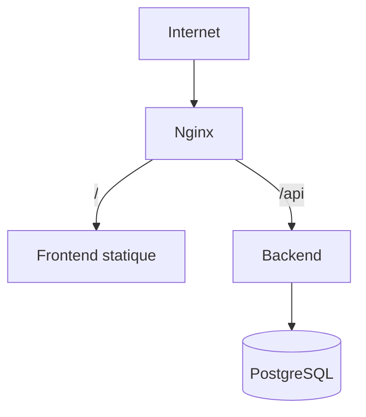

# MVP — Déploiement

## 1. Cible

Déploiement simple sur **un seul serveur (VPS)** avec **Docker Compose** :
- `frontend` (build statique servi par Nginx)
- `backend` (API Node/Express)
- `db` (PostgreSQL)
- `nginx` (reverse proxy + TLS)



---

## 2. Conteneurs

### `docker-compose.yml` (schéma)
```yaml
services:
  db:
    image: postgres:16
    environment:
      POSTGRES_USER: ${DB_USER}
      POSTGRES_PASSWORD: ${DB_PASSWORD}
      POSTGRES_DB: ${DB_NAME}
    volumes: [ "pgdata:/var/lib/postgresql/data" ]
    restart: unless-stopped

  backend:
    build: ./backend
    env_file: ./backend/.env
    depends_on: [ db ]
    restart: unless-stopped

  frontend:
    build: ./frontend     # build Vite -> /dist servi par nginx interne ou copié
    depends_on: [ backend ]

  nginx:
    image: nginx:alpine
    ports: [ "80:80", "443:443" ]
    volumes:
      - ./nginx/nginx.conf:/etc/nginx/conf.d/default.conf:ro
      - ./certbot/conf:/etc/letsencrypt
    depends_on: [ backend, frontend ]
    restart: unless-stopped

volumes:
  pgdata:
```

---

## 3. Dockerfiles

### Backend (multi-stage)
```
FROM node:20-alpine AS build
WORKDIR /app
COPY package*.json ./ && npm ci
COPY . . && npm run build
FROM node:20-alpine
WORKDIR /app
COPY --from=build /app/dist ./dist
COPY package*.json ./ && npm ci --omit=dev
CMD ["node", "dist/server.js"]
```

### Frontend
```
FROM node:20-alpine AS build
WORKDIR /app
COPY package*.json ./ && npm ci
COPY . . && npm run build      # -> /app/dist
FROM nginx:alpine
COPY --from=build /app/dist /usr/share/nginx/html
```

---

## 4. Nginx (reverse proxy)

```nginx
server {
  listen 80;
  server_name app.exemple.dz;
  # redirige vers HTTPS en prod (Certbot)

  location /api/ {
    proxy_pass http://backend:4000/api/;
    proxy_set_header Host $host;
    proxy_set_header X-Forwarded-For $proxy_add_x_forwarded_for;
  }
  location / {
    root /usr/share/nginx/html;
    try_files $uri /index.html;     # SPA fallback
  }
  client_max_body_size 6M;          # uploads Excel
}
```

- **TLS** via Certbot / Let's Encrypt (renouvellement auto).

---

## 5. Environnements

| Env | Usage |
|---|---|
| `local` | dev (Vite `:5173`, API `:4000`, Postgres Docker) |
| `production` | VPS Docker Compose |

- Variables séparées par env, jamais commitées.
- `NODE_ENV=production` désactive les traces détaillées.

---

## 6. Migrations & seed au déploiement

- Au démarrage du backend (ou via `npm run migrate`) : appliquer les migrations.
- Seed exécuté **une seule fois** (admin + agences) — idempotent ou conditionné.

---

## 7. Sauvegardes (MVP)

- **Dump PostgreSQL quotidien** : `pg_dump` via tâche cron sur l'hôte → fichier daté.
- Rétention simple (ex. 7 jours).
- Test de restauration documenté.

---

## 8. Logs & supervision (niveau MVP)

- Logs applicatifs `pino` → stdout (collectés par Docker).
- `docker compose logs` pour le diagnostic.
- Healthcheck `GET /api/health` (200) pour vérifier la vivacité.

---

## 9. Procédure de déploiement (résumé)

```text
1. Provisionner le VPS (Docker + Docker Compose installés)
2. Cloner le dépôt, créer les fichiers .env (backend, db)
3. Configurer le domaine (DNS A record) vers le VPS
4. docker compose up -d --build
5. Obtenir le certificat TLS (Certbot)
6. Exécuter migrations + seed
7. Vérifier /api/health et la page de login
```

---

## 10. Pré-requis avant mise en prod

- [ ] Secrets forts générés (JWT, DB)
- [ ] CORS limité au domaine
- [ ] HTTPS actif
- [ ] Sauvegarde testée
- [ ] Compte admin créé, mot de passe changé
- [ ] `npm audit` sans vulnérabilité critique
